# AtliQ-Hardware-Sales-Performance-Ad-Hoc-Analysis-
AtliQ hardware is a rapidly growing company that manufactures PC, Accessories and peripherals, and in recent years, they have decided to implement data analytics into their business process for the first time to enable them track trends, stay competitive and to make data driven decision.
## Objectives
The objective of this project is to leverage SQL for ad-hoc analysis to evaluate sales performance, assess profitability, understand customer behavior, and efficiently address dynamic data requests from stakeholders of AtliQ. The goal is to provide actionable insights and support decision-making through robust and flexible data querying techniques.
## Key Question
1. What is the total revenue broken down by customer, platform, and sales channel?
2. Which region contributed the highest total revenue?
3. What is the total revenue segmented by product category, division, and market segment?
4. Which top five markets have generated the highest lifetime revenue?
5. What is the impact of freight costs on revenue across different markets?
6. Who are our highest-value customers based on frequency of orders?
7. What is the average selling price (ASP) across all markets?

## Data Collection
The dataset for this analysis comprises over **500,000** records, covering the period from **2017 to 2021**. It includes the following key tables stored in a MySQL database:
- **dim_customers:** Contains customer-related attributes.
- **dim_products:** Includes details about product categories, divisions, and segments.
- **fact_sales_monthly:** Provides monthly sales data, including revenue and units sold.
- **fact_gross_price:** Captures gross product pricing details.
- **fact_freight_cost:** Records freight costs associated with sales transactions.
- **fact_post_invoice_deductions:** Tracks post-invoice deductions, such as discounts or rebates.
- **fact_manufacturing_cost:** Contains manufacturing cost data for products.
 SQL queries will be used to extract and analyze this data to address the key business questions effectively.

## Data Preparation
We’ll create a sales performance model by combining these tables in MySQL database:
- **fact_sales_monthly:** Sales quantity data.
- **fact_gross_price:** Gross price per product.
- **fact_manufacturing_cost:** Manufacturing costs.
- **fact_freight_cost:** Freight costs by market and year.
- **fact_post_invoice_deductions:** Discounts impacting revenue.
- **dim_customer** 
- **dim_product**

We will write **SQL queries** to clean and join this data into a cohesive dataset for analysis.

## Model Building
We’ll write **SQL queries** step by step to address the key questions. Here’s how:

**Query 1:** **Total Revenue by customer, platform, and sales channel**

```sql
SELECT 
    c.customer,
    c.platform,
    c.channel,
    SUM(ROUND(sm.sold_quantity * gp.gross_price,2)) AS total_revenue
FROM fact_sales_monthly sm
JOIN dim_customer c ON sm.customer_code = c.customer_code
JOIN fact_gross_price gp ON sm.product_code = gp.product_code
GROUP BY c.customer, c.platform, c.channel
ORDER BY total_revenue DESC;
```

MySQL Result                          |                Visualization
:------------------------------------:|:-----------------------------------:
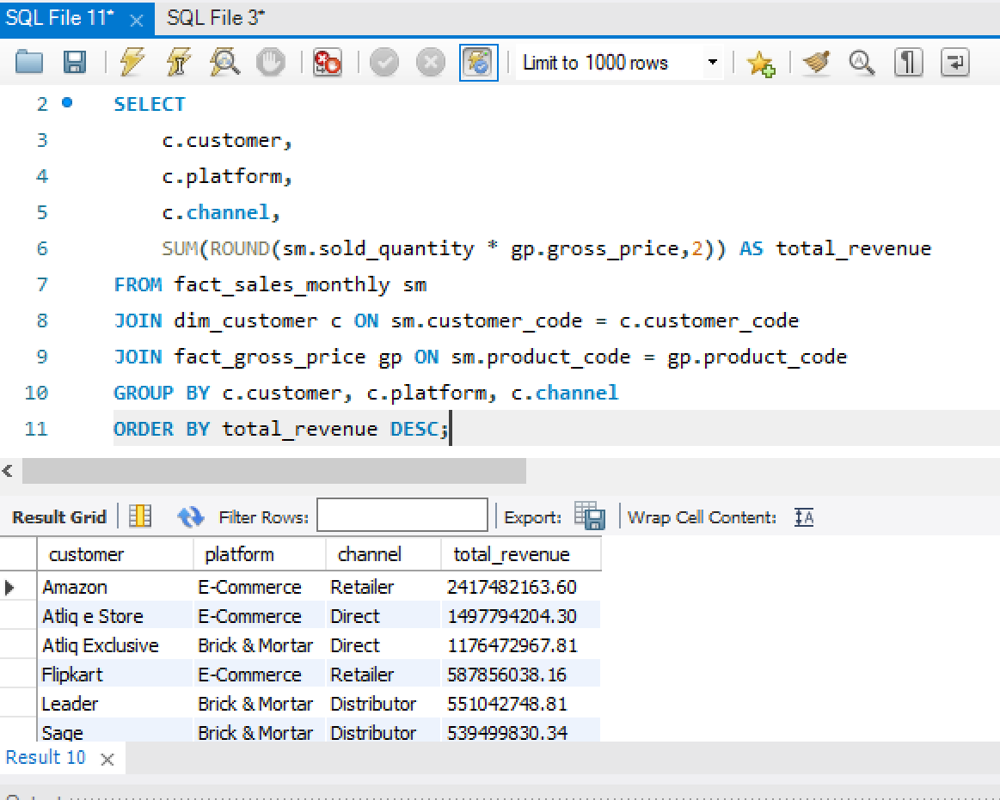            |      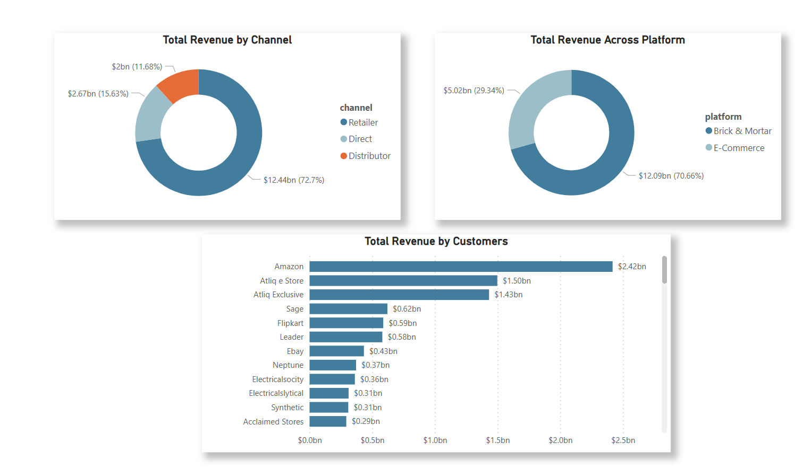


**Insights:** 
- The **Retailers channel** emerged as the top revenue generator, contributing **$12.44 billion**, followed by the **Direct-to-Consumer** channel with **$2.67 billion**, and the **Distributor channel**, which generated **$2 billion**.
- Among platforms, **Ecommerce** led the way with **$12.09 billion** in revenue, significantly outperforming **Brick & Mortar (physical stores)**, which accounted for **$5.02 billion**.
- **Amazon** ranked as the highest revenue-generating customer, contributing **$2.42 billion**, followed by **Atliq e Store** with **$1.50 billion**, and **Atliq Exclusive**, which generated **$1.43 billion**.

**Recommendations:** 
- Strengthen relationships with top-performing channels and customers like **Amazon, Atliq e Store, and Atliq Exclusive** through tailored solutions, loyalty programs, and co-marketing opportunities.
- Optimize the online shopping experience with faster delivery, better functionality, and targeted digital campaigns while revitalizing Brick & Mortar stores with enhanced in-store experiences.
- Develop personalized marketing strategies for direct sales and explore untapped potential in the Distributor channel to drive additional revenue.
- Seamlessly integrate online and offline sales channels, leveraging customer data to tailor offerings and improve overall customer satisfaction.


**Query 2:** **Total Revenue by Region**

```sql
SELECT 
    c.region,
    SUM(ROUND(sm.sold_quantity * gp.gross_price,2)) AS total_revenue
FROM fact_sales_monthly sm
JOIN dim_customer c ON sm.customer_code = c.customer_code
JOIN fact_gross_price gp ON sm.product_code = gp.product_code
GROUP BY c.region
ORDER BY total_revenue DESC;

```
MySQL Result                          |                Visualization
:------------------------------------:|:-----------------------------------:
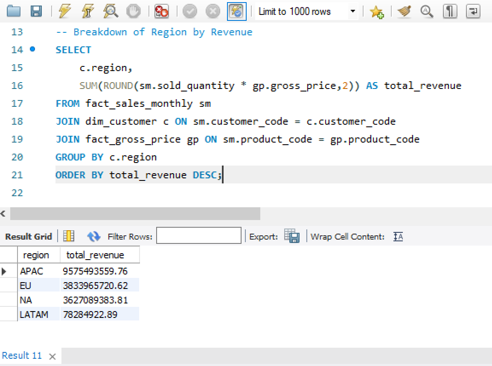                       |      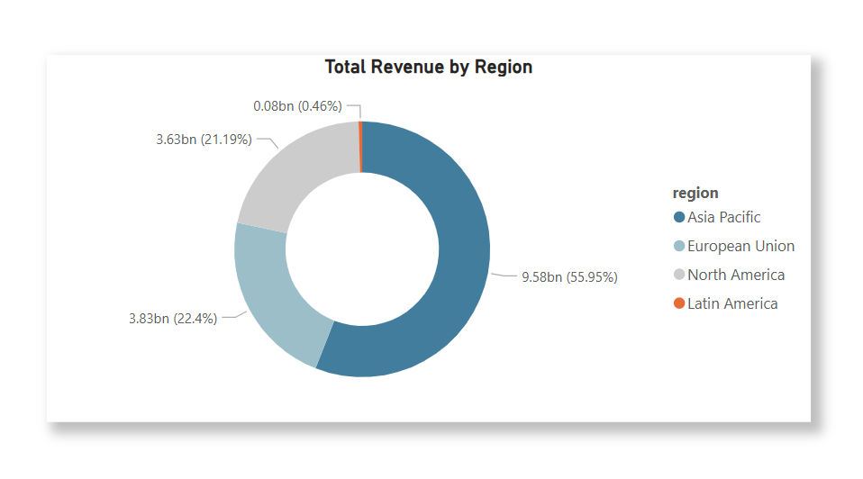


**Insights:** 
- The **Asia Pacific region** led revenue generation with **$9.58 billion**, followed by the **European Union** with **$3.83 billion** and **North America** with **$3.63 billion**. **Latin America** contributed **$80 million** in revenue.

**Recommendations:** 
- Strengthen presence in the Asia Pacific region by focusing on maintaining and expanding market share through localized marketing strategies, partnerships, and tailored product offerings to sustain growth.
- Leverage growth potential in the European Union and North America by investing in targeted marketing campaigns and exploring opportunities to expand product reach. Optimize distribution networks and strengthen relationships with key partners to boost revenue.
- Develop strategies for Latin America by assessing the challenges and implementing solutions such as adapting pricing models, introducing region-specific products, and increasing brand awareness to unlock growth potential.
- Diversify regional revenue streams by exploring untapped or underperforming markets outside the top regions to reduce over-reliance on the Asia Pacific and create more balanced global revenue.


**Query 3:** **Total Revenue by Division, Segment and Product Category**

```sql
SELECT 
    p.division,
    p.segment,
    p.category,
    SUM(ROUND(sm.sold_quantity * gp.gross_price,2)) AS total_revenue
FROM fact_sales_monthly sm
JOIN dim_product p ON sm.product_code = p.product_code
JOIN fact_gross_price gp ON sm.product_code = gp.product_code
GROUP BY p.division, p.segment, p.category
ORDER BY total_revenue DESC;

```
MySQL Result                          |                Visualization
:------------------------------------:|:-----------------------------------:
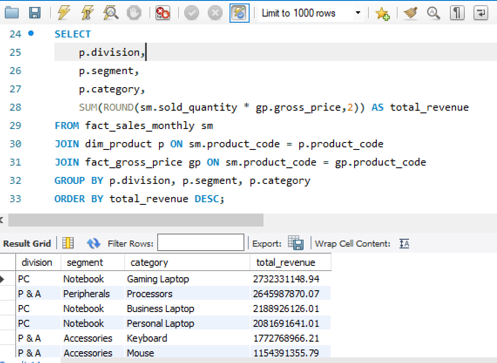             |      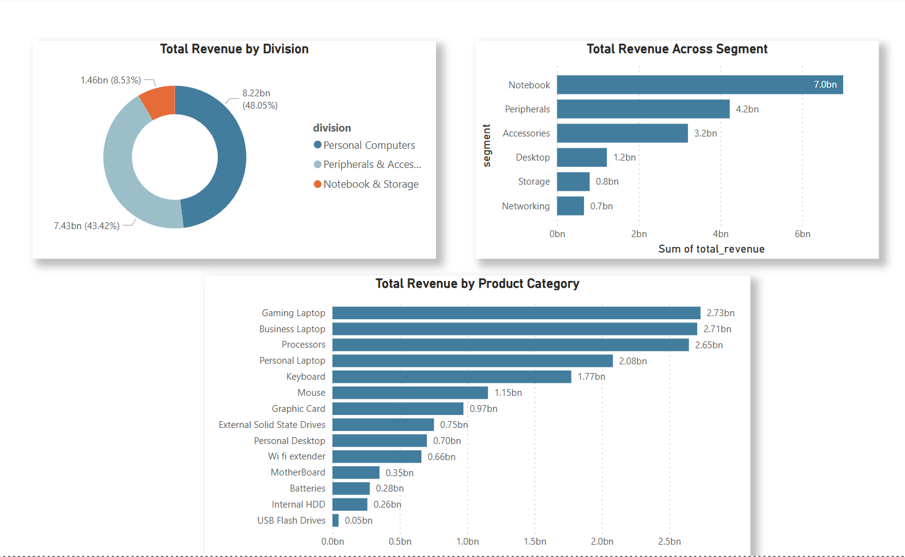


**Insights:** 
- The **Personal Computers division** emerged as the top revenue contributor with **$8.22 billion**, followed by the **Peripherals & Accessories division** at **$7.43 billion** and the **Notebook & Storage division** at **$1.46 billion**.
- Within segments, the **Notebook segment** led with **$7 billion** in revenue, followed by **Peripherals** at **$4.2 billion** and **Accessories** at **$3.2 billion**. The **Networking segment** generated the least revenue, contributing **$700 million**.
- Among categories, the **Gaming Laptop category** generated the highest revenue at **$2.73 billion**, closely followed by **Business Laptop** at **$2.71 billion** and **Processors** at **$2.65 billion**. The **USB Flash Drive category** brought in the lowest revenue, contributing **$50 million**.

**Recommendations:** 
- Expand market share and innovation in high-performing divisions like Personal Computers and segments like Notebooks to sustain and boost revenue.
- Leverage the strong revenue from Peripherals & Accessories by launching new products, enhancing customer experience, and expanding distribution channels.
- Address the low revenue in the Networking segment and USB Flash Drive category by analyzing market needs, adjusting pricing strategies, or introducing innovative solutions.
- Strengthen marketing efforts and product differentiation for Gaming and Business Laptop categories to capitalize on significant revenue opportunities.

**Query 4:** **Top 5 Markets with Highest Revenue**

```sql
SELECT 
	market,
    total_revenue,
    revenue_rank
FROM (
    SELECT 
		c.market,
        SUM(ROUND(sm.sold_quantity * gp.gross_price,2)) AS total_revenue,
        RANK() OVER (ORDER BY SUM(sm.sold_quantity * gp.gross_price) DESC) AS revenue_rank
    FROM fact_sales_monthly sm
    JOIN dim_customer c ON sm.customer_code = c.customer_code
    JOIN fact_gross_price gp ON sm.product_code = gp.product_code
    GROUP BY c.market
) ranked_markets
WHERE revenue_rank <= 5
ORDER BY revenue_rank;

```
MySQL Result                          |                Visualization
:------------------------------------:|:-----------------------------------:
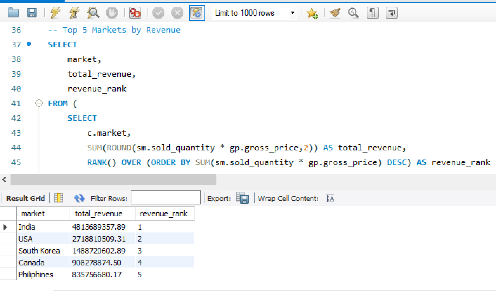              |      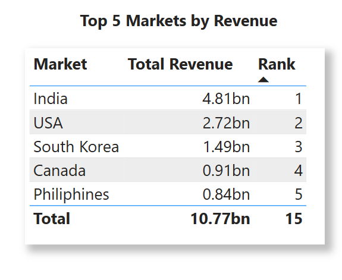


**Insights:** 

- **India** led the top markets in revenue with **$4.81 billion**, followed by the **USA** at **$2.72 billion**. **South Korea** ranked third with **$1.49 billion**, while **Canada** generated **$900 million**, and the **Philippines** rounded out the top five with **$840 million** in revenue.

**Recommendations:** 
- Strengthen presence in India by focusing on enhancing marketing efforts, increasing product availability, and exploring new distribution channels to sustain growth.
- Boost revenue in the USA and South Korea by strengthening relationships with key partners and optimizing marketing strategies to drive further growth.
- Enhance market penetration in Canada and the Philippines by tailoring strategies to increase brand awareness and exploring region-specific product offerings to capture untapped potential.
- Diversify market reach by investigating opportunities to enter new or underperforming markets, reducing dependency on top-performing regions, and creating more balanced global revenue streams.


**Query 5:** **Freight Cost Impact on Revenue across Markets**

```sql
WITH MarketRevenue AS (
    SELECT 
        c.market,
        SUM(ROUND(sm.sold_quantity * gp.gross_price,2)) AS total_revenue
    FROM fact_sales_monthly sm
    JOIN dim_customer c ON sm.customer_code = c.customer_code
    JOIN fact_gross_price gp ON sm.product_code = gp.product_code
    GROUP BY c.market
),
FreightCost AS (
    SELECT 
        fc.market,
        AVG(ROUND(fc.freight_pct,2)) AS avg_freight_cost
    FROM fact_freight_cost fc
    GROUP BY fc.market
)
SELECT 
    mr.market,
    mr.total_revenue,
    fc.avg_freight_cost,
    ROUND(fc.avg_freight_cost * mr.total_revenue,2) AS freight_cost_impact
FROM MarketRevenue mr
JOIN FreightCost fc ON mr.market = fc.market
ORDER BY freight_cost_impact DESC;

```
MySQL Result                          |                Visualization
:------------------------------------:|:-----------------------------------:
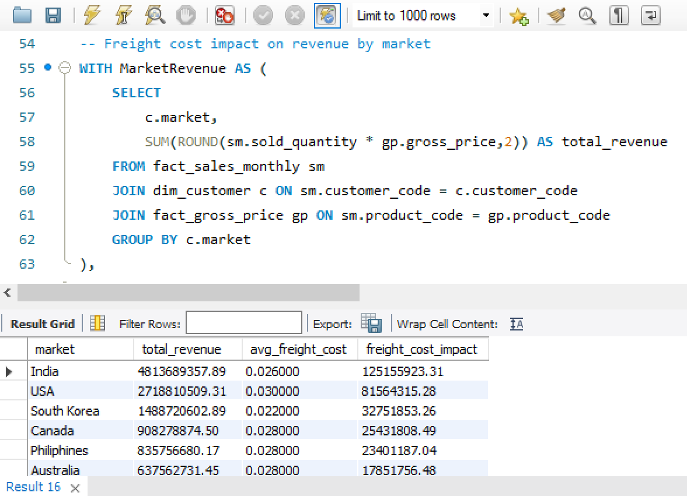                 |      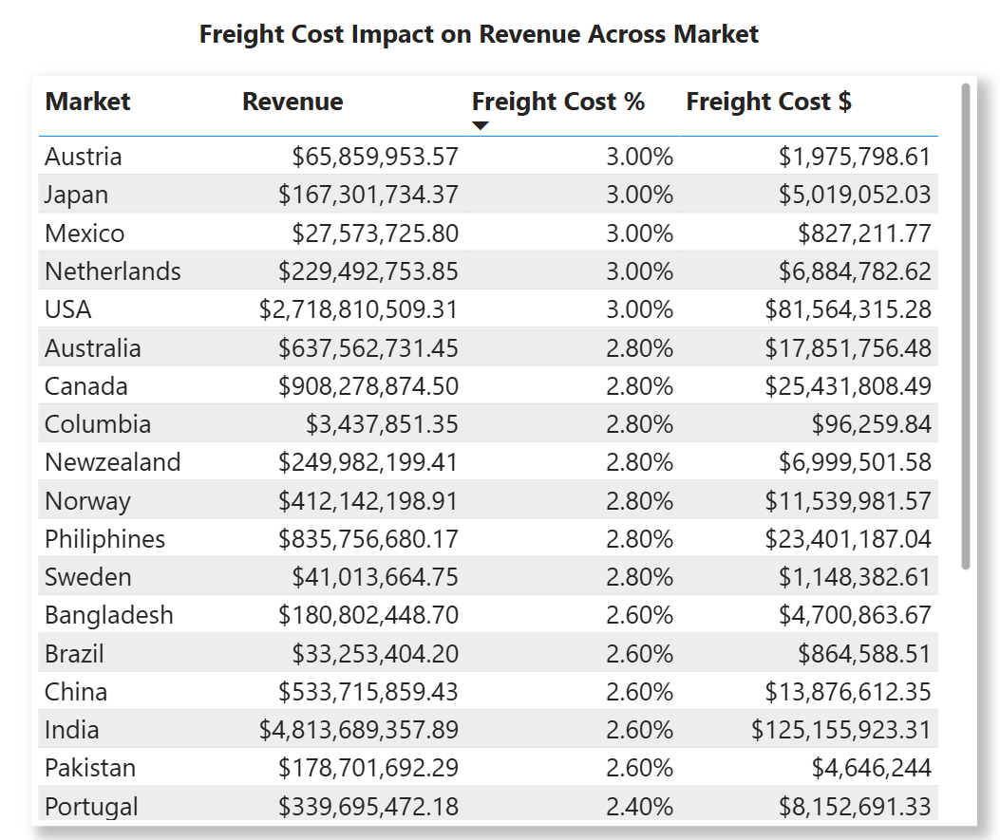


**Insights:** 
- In **Austria, Japan, Mexico, the Netherlands, and the USA**, freight costs accounted for **3%** of revenue. In other markets, freight costs had a slightly lower impact, contributing **2.8%, 2.6%, and 2.4% of revenue**, respectively, highlighting varying levels of impact on revenue across different regions.

**Recommendations:** 
- Focus on reducing freight costs in Austria, Japan, Mexico, the Netherlands, and the USA by negotiating better logistics rates, exploring more cost-efficient transportation methods, and optimizing supply chains.
- Apply cost-reduction strategies in other markets with lower freight costs (2.8%, 2.6%, and 2.4%) to maintain profitability while ensuring the competitiveness of the product offerings.
- Conduct a detailed analysis of the relationship between freight costs and revenue in different regions, to identify opportunities to adjust pricing or shipping strategies effectively.
- Explore the option of regional price adjustments to help mitigate the impact of higher freight costs on revenue without affecting customer demand.


**Query 6:** **High Value Customers**

```sql
SELECT 
    c.customer,
    COUNT(DISTINCT YEAR(sm.date)) AS purchase_years,
    COUNT(sm.date) AS total_purchases,
    AVG(sm.sold_quantity) AS avg_quantity_per_purchase
FROM fact_sales_monthly sm
JOIN dim_customer c ON sm.customer_code = c.customer_code
GROUP BY c.customer
ORDER BY total_purchases DESC;

```

MySQL Result                          |                Visualization
:------------------------------------:|:-----------------------------------:
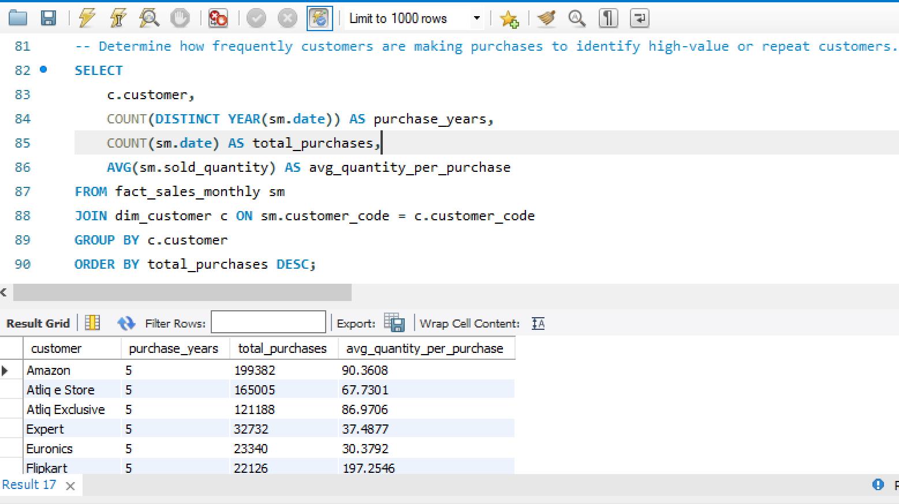         |      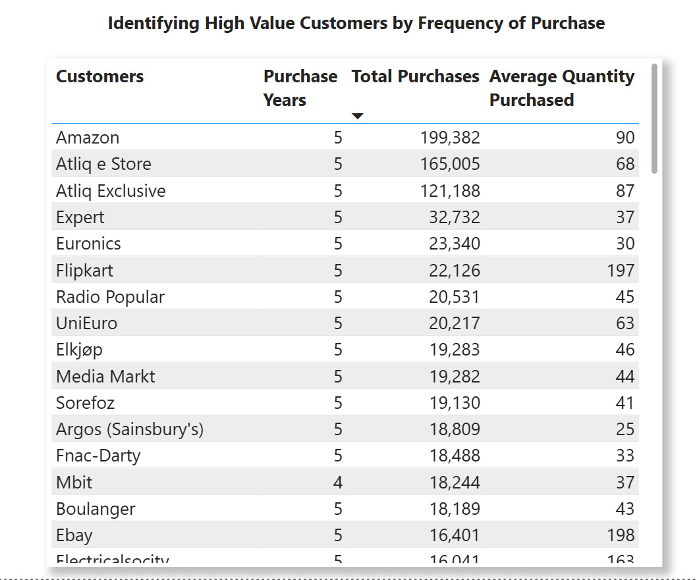


**Insights:** 
- **Amazon** emerged as the top high-value customer, with a purchasing history spanning **5 years**. Their total purchase volume since inception reached approximately **199,382 units**, with an average purchase quantity of **90 units**.
- **Atliq e Store** followed closely, also with **5 years** of purchasing history. They accumulated a total of **165,005 units**, averaging **68 units** per purchase.
- **Atliq Exclusive**, with a **five-year** purchasing history, recorded a total of **121,188 units**, with an average purchase quantity of **87 units**.

**Recommendations:** 
- Focus on strengthening the relationship with Amazon. Leverage their high purchase volume and long-term commitment to build stronger partnerships, offering exclusive deals or custom offerings to maintain their loyalty and further increase sales.
- Target Atliq e Store for growth, given their substantial purchase volume, explore opportunities to increase the average purchase per order, such as offering larger volume discounts or bundling products to encourage bigger purchases.
- Increase purchases from Atliq Exclusive. While their total purchases are lower than Amazon and Atliq e Store, there is potential for growth by introducing targeted promotions or cross-selling strategies to increase both the frequency and quantity of purchases.

**Query 7:** **Average Selling Price Across Markets**


```sql
SELECT 
    c.market,
    SUM(sm.sold_quantity * gp.gross_price) / SUM(sm.sold_quantity) AS avg_selling_price
FROM fact_sales_monthly sm
JOIN dim_customer c ON sm.customer_code = c.customer_code
JOIN fact_gross_price gp ON sm.product_code = gp.product_code
GROUP BY c.market
ORDER BY avg_selling_price DESC;

```

MySQL Result                          |                Visualization
:------------------------------------:|:-----------------------------------:
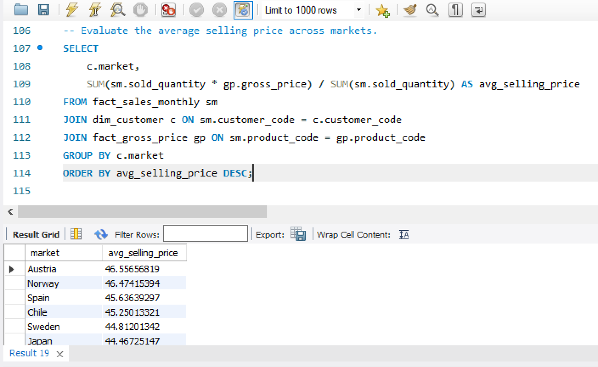        |      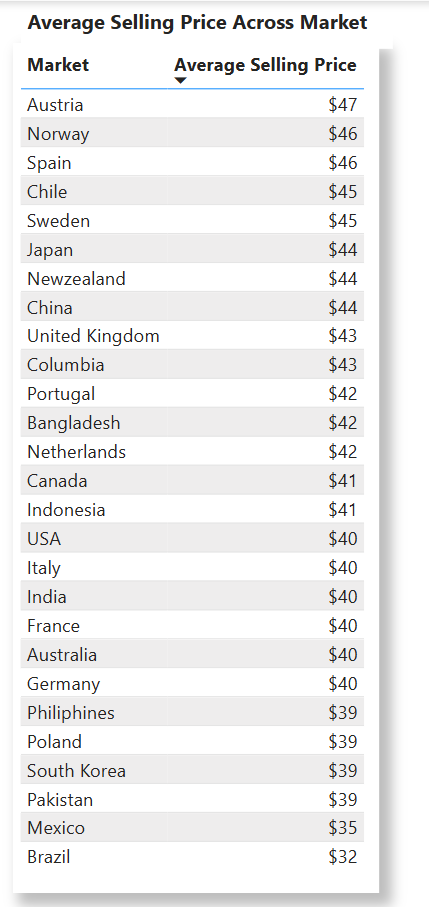


**Insights:** 
- The average selling price across markets varies, with **Austria** leading at **$47**, followed by **Norway and Spain** at **$46**. **Chile and Sweden** have an average selling price of **$45**, while **Japan, New Zealand, and China** are priced at **$44**. The **United Kingdom and Colombia** have an average price of **$43**. In other markets, the price ranges between **$42 and $39**.

**Recommendations:** 
- Maintain the competitive advantage in Austria by enhancing the value proposition and exploring opportunities to increase pricing.
- Leverage the strong average selling price in Norway and Spain, while exploring ways to expand market share.
- Optimize pricing strategies in Chile and Sweden to sustain sales and improve profitability.
- In Japan, New Zealand, and China, focus on maintaining the price point while differentiating products and using promotions to boost sales.
- Assess market conditions in the United Kingdom and Colombia to determine whether slight price adjustments or targeted marketing could increase competitiveness.
- Investigate local market dynamics and consumer behavior in markets with prices between $42 and $39 to identify opportunities for premium positioning or cost efficiency.


## Ad-Hoc Task 1 
- Create a Stored procedure that returns the monthly sales figure across customers and market.

**Query 8**

```sql
DELIMITER $$

CREATE PROCEDURE GetMonthlySalesByCustomerRegion(
    IN start_date DATE,
    IN end_date DATE,
    IN market_filter VARCHAR(255)
)
BEGIN
    SELECT 
        DATE_FORMAT(sm.date, '%Y-%m') AS sales_month,
        c.customer,
        c.market,
        SUM(sm.sold_quantity * gp.gross_price) AS total_monthly_sales
    FROM fact_sales_monthly sm
    JOIN dim_customer c ON sm.customer_code = c.customer_code
    JOIN fact_gross_price gp ON sm.product_code = gp.product_code
    WHERE sm.date BETWEEN start_date AND end_date
    AND (market_filter IS NULL OR c.market = market_filter) 
    GROUP BY 
        DATE_FORMAT(sm.date, '%Y-%m'),
        c.customer,
        c.market
    ORDER BY 
        sales_month ASC,
        c.market ASC,
        total_monthly_sales DESC;
END$$

DELIMITER ;

```
## Ad-Hoc Task 2
- Generate the monthly sales report for United Kingdom for the period between 01/01/2020 to 31/12/2020 from the stored procedure created
  
**MySQL Result**
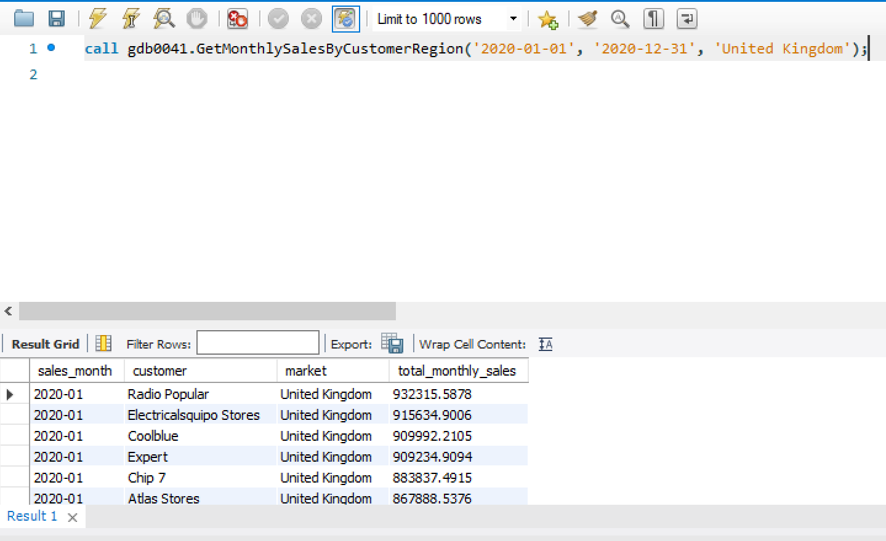


### Tools used:
- MySQL database: Data storage and validation
- SQL: for querying database and performing analysis
- Power BI: Extract, Transform, and Load. Also, for performing exploratory analysis, dashboard creation, interactivity, and visual analysis.

### Contact Information
Email: luckyodeh001@gmail.com


